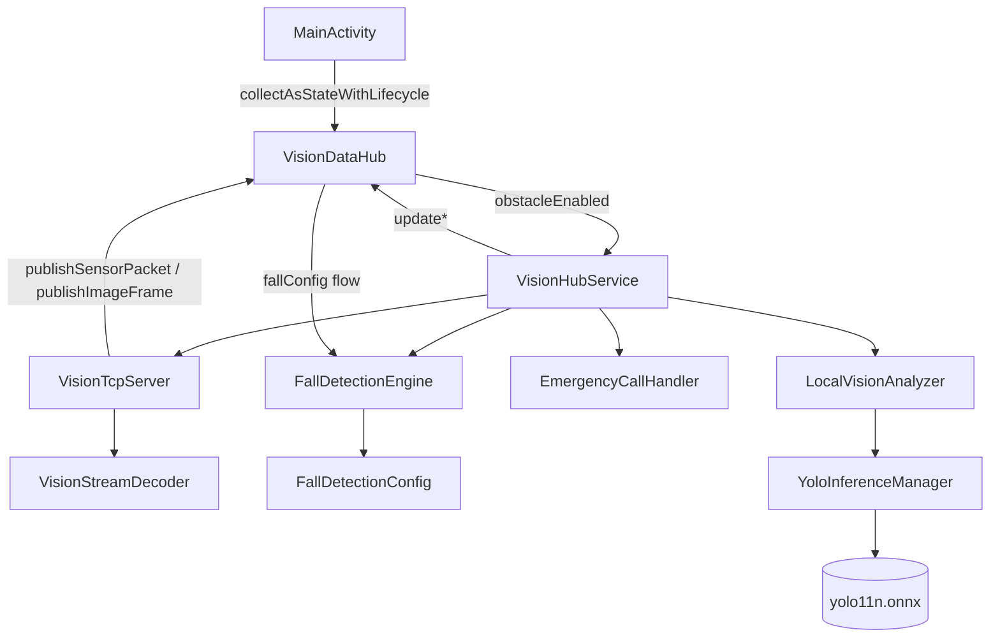

# 暖阳智视 (VisionHub) — 系统架构

## 1. 系统总览

```
ESP32-S3 wearable badge          Android phone (compute hub)         Cloud backend
┌──────────────────┐  TCP 8080   ┌───────────────────────────┐  HTTP  ┌──────────────┐
│  IMU / Radar /   │ ──────────▶ │  VisionHubService          │ ─────▶ │  Go Fiber    │
│  Buttons / JPEG  │             │  ├─ FallDetectionEngine    │        │  REST API    │
└──────────────────┘             │  ├─ YoloInferenceManager   │        │  :3000       │
                                 │  └─ VisionTcpServer        │        └──────┬───────┘
                                 │                             │               │
                                 │  Compose UI                 │        ┌──────▼───────┐
                                 │  ├─ HomeScreen              │        │  Redis       │
                                 │  ├─ ObstacleScreen          │        │  (cache)     │
                                 │  ├─ RecognitionScreen       │        └──────┬───────┘
                                 │  ├─ DeviceScreen            │               │
                                 │  ├─ ProfileScreen           │        ┌──────▼───────┐
                                 │  └─ HistoryScreen           │        │  Kafka       │
                                 └───────────────────────────┘        │  (events)    │
                                                                        └──────┬───────┘
                                                                               │
                                                                        ┌──────▼───────┐
                                                                        │  PostgreSQL  │
                                                                        │  (persist)   │
                                                                        └──────────────┘
```

---

## 2. Android 应用架构

### 层次划分

```
┌─────────────────────────────────────────────────────┐
│  Activity 层                                          │
│  └── MainActivity  (权限引导 · 启动服务 · 设置内容)    │
├─────────────────────────────────────────────────────┤
│  导航层                                               │
│  └── VisionHubScreen  (rememberSaveable 目标状态)    │
│       └── 6 个屏幕  (HomeScreen / ObstacleScreen …)  │
├─────────────────────────────────────────────────────┤
│  UI 组件层  (ui/components/)                          │
│  ├─ AppWordmark · GiantActionCard · StatusBanner     │
│  ├─ RadarPanel · MetricCard · VolumeCard             │
│  ├─ Buttons (PillActionButton · SecondaryWideButton) │
│  ├─ SettingWidgets · CaptureCard                     │
│  └─ DeviceCards · ProfileCards · RecognitionResultCard│
├─────────────────────────────────────────────────────┤
│  状态层  (无 ViewModel — 直接 collectAsStateWithLifecycle) │
│  └── VisionDataHub (object singleton)                │
│       ├─ StateFlow<ConnectionState>                  │
│       ├─ StateFlow<FallAlertState>                   │
│       ├─ StateFlow<LocalVisionState>                 │
│       ├─ StateFlow<Boolean>  obstacleEnabled         │
│       ├─ StateFlow<FallDetectionConfig>  fallConfig  │
│       ├─ SharedFlow<SensorPacket>                    │
│       └─ SharedFlow<ByteArray>  (JPEG 帧)            │
├─────────────────────────────────────────────────────┤
│  Service 层  (Dispatchers.IO · SupervisorJob)         │
│  └── VisionHubService  (前台服务)                     │
│       ├─ VisionTcpServer  (TCP :8080 · 接受客户端)    │
│       │    └─ VisionStreamDecoder  (混合流解析器)      │
│       ├─ FallDetectionEngine  (IMU 状态机)            │
│       │    └─ FallDetectionConfig  (运行时可热重载)    │
│       ├─ EmergencyCallHandler  (ACTION_CALL)          │
│       └─ LocalVisionAnalyzer                         │
│            └─ YoloInferenceManager  (ONNX Runtime)   │
└─────────────────────────────────────────────────────┘
```

### 辅助模块

| 路径 | 职责 |
|------|------|
| `navigation/VisionHubDestination.kt` | 导航枚举 (5 底栏 + 1 浮层) |
| `ui/AppColors.kt` | 全局颜色常量 |
| `ui/AppModels.kt` | UI 层数据类 (HistoryRecord, StatMetric) |
| `util/UiStateHelpers.kt` | 纯 Kotlin 状态→字符串辅助函数 |
| `util/VolumePreference.kt` | SharedPreferences 持久化音量 |
| `util/SensitivityPreference.kt` | SharedPreferences 持久化灵敏度 + 预设值 |

---

## 3. 后端微服务 (Go)

**目录**: `backend/`  
**框架**: Fiber v2 | **ORM**: GORM | **MQ**: Kafka | **缓存**: Redis

### 路由

| 方法 | 路径 | 处理器 | 描述 |
|------|------|--------|------|
| GET  | `/healthz` | 内联 | 健康检查 |
| POST | `/api/v1/event/report` | EventHandler | 上报跌倒事件 |
| POST | `/api/v1/recognize/medicine` | MedicineHandler | 药品识别 (OCR→Redis→LLM) |

### 管道

```
POST /recognize/medicine
  │
  ├─ 提取 image_base64 → 计算 MD5 缓存键
  ├─ Redis GET  → 命中 → 直接返回 tts_text
  └─ 未命中 → OCR stub → LLM stub → Redis SET (TTL 30天)
                                  → Kafka Publish (best-effort)
                                  → 返回 tts_text

Kafka Consumer (goroutine)
  └─ 消费 sensor_events topic → GORM INSERT → PostgreSQL event_logs
```

---

## 4. TCP 流协议 (设备 → Android)

同一 TCP 连接上交织两种帧，无应用层帧头：

```
帧类型     判定方式                  格式
────────   ──────────────────────   ─────────────────────────────────
传感器帧   以 \n 结尾的行           {"radar_dist":42,"ax":0.12,...}\n
图像帧     字节前缀 0xFF 0xD8       [JPEG SOI ... EOI 0xFF 0xD9]
```

**SensorPacket 字段：**

| 字段 | 类型 | 说明 |
|------|------|------|
| `radar_dist` | Int | 雷达距离 (cm) |
| `ax` `ay` `az` | Double | IMU 加速度 (m/s²) |
| `btn_a` `btn_b` | Int | 按钮状态 (0/1) |

---

## 5. 依赖图



---

## 6. 数据流说明

### 跌倒检测流

```
SensorPacket (TCP)
  → VisionTcpServer.publish()
  → VisionDataHub.sensorPackets (SharedFlow)
  → VisionHubService.observeSensorPackets()
  → FallDetectionEngine.process()
  → FallAlertState (StateFlow)
  → UI (ObstacleScreen / HomeScreen banner)
  → [若 shouldTriggerEmergency] EmergencyCallHandler.triggerEmergencyCall()
```

### 药品识别流

```
相机快门 (CaptureCard)
  → ActivityResultContracts.TakePicture()
  → FileProvider URI → 读取 JPEG bytes
  → VisionDataHub.publishImageFrame()
  → VisionHubService.observeImageFrames()
  → [gated by obstacleEnabled]
  → YoloInferenceManager.analyze()
  → LocalVisionState (StateFlow)
  → RecognitionScreen (summary · status)
  → [可选] POST /api/v1/recognize/medicine → tts_text
  → TextToSpeech.speak()
```

### UI 导航流

```
VisionHubScreen.currentDestination (rememberSaveable)
  → when(currentDestination) {}
  → 渲染对应屏幕 Composable
  → 底栏 NavigationBarItem.onClick → 切换 destination
  → HISTORY 作为浮层 (RECOGNITION tab 高亮 + 无底栏)
```
